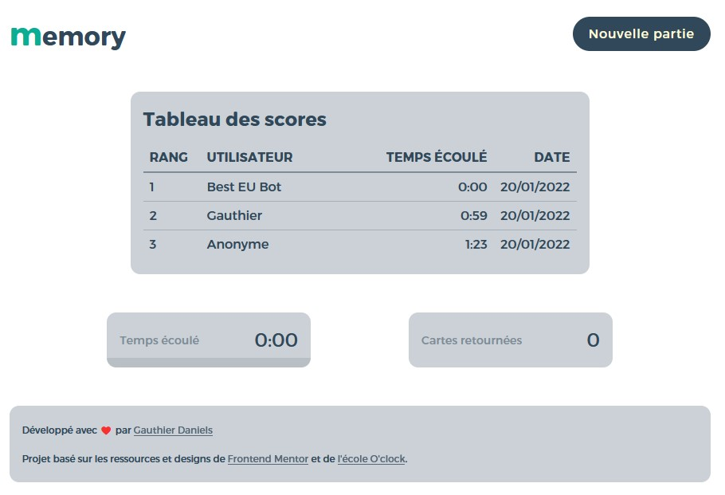
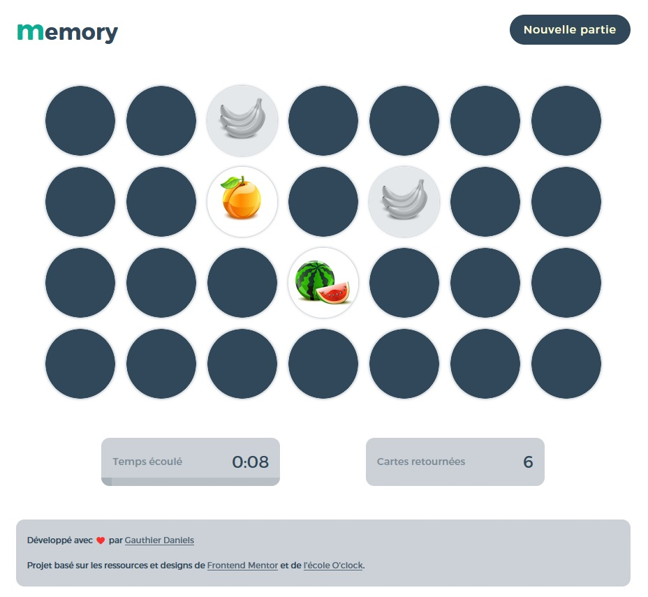

# Le jeu de memory ! 🃏 <!-- omit in toc -->

Non non vous ne rêvez pas, on parle bien du jeu de memory ou comme dit si bien Wikipédia : "Jeu de paires" !

Même si le jeu est simpliste en soit, il va tout de même falloir bien structurer la stratégie de développement pour éviter de nous perdre dans toute l'architecture du projet.

Mais promis, vous serez bien guidé au travers des différents commits, des commentaires et de ce readme ! 🤓

---

## Table des matières
- [Table des matières](#table-des-matières)
- [Préambule](#préambule)
- [Les règles de notre memory](#les-règles-de-notre-memory)
- [Développons le jeu !](#développons-le-jeu-)
  - [1 - ⚠️ Avant toutes choses ⚠️](#1---️-avant-toutes-choses-️)
    - [1.1 - Dépendances pour transpilation](#11---dépendances-pour-transpilation)
      - [1.1.1 - Mais c'est quoi tous ces paquets ?!](#111---mais-cest-quoi-tous-ces-paquets-)
    - [1.2 - Autres dépendances](#12---autres-dépendances)
  - [2 - Préparer l'application](#2---préparer-lapplication)
  - [3 - Les scripts](#3---les-scripts)
- [Visuels attendus pour notre memory](#visuels-attendus-pour-notre-memory)
  - [Tableau des scores _(vide)_](#tableau-des-scores-vide)
  - [Tableau des scores](#tableau-des-scores)
  - [Partie en cours](#partie-en-cours)
  - [Fin de partie](#fin-de-partie)

---

## Préambule
Dans ce readme, les commandes à passer dans le terminal seront basées sur [Yarn](https://yarnpkg.com/) au lieu de [NPM](https://www.npmjs.com/).  
Vous n'êtes, bien entendu, pas obligés de passer par Yarn !

Si vous vous sentez perdus avec ces commandes, n'hésitez pas à regarder [cette page](https://classic.yarnpkg.com/lang/en/docs/migrating-from-npm/) qui présente une liste d'équivalents syntaxiques entre NPM et Yarn.

---

## Les règles de notre memory
Chaque grille de jeu est composée de 14 fruits représentés sur 2 cartes au sein de cette même grille, ce qui donne donc un total de 28 cartes sur la grille de jeu.

Une partie prend fin dès que le temps maximal accordé est écoulé, ou bien dès que toutes les paires ont été trouvées.

À chaque tour, le joueur pourra choisir deux cartes à retourner, à condition que :
- La carte n'a pas déjà été trouvée
- La carte n'est pas retournée

Dès que le joueur a retourné deux cartes et que les deux cartes comportent le même fruit, le joueur peut immédiatement retourner deux nouvelles cartes.  
Dans le cas contraire, le joueur a un petit laps de temps pour visualiser les cartes qu'il a retourné avant de pouvoir retourner deux nouvelles cartes.

---

## Développons le jeu !

### 1 - ⚠️ Avant toutes choses ⚠️
#### 1.1 - Dépendances pour transpilation
Comme nous allons utiliser des syntaxes et fonctionnalités qui ne sont pas interprétées par les navigateurs, nous allons devoir transpiler notre code pour le rendre compatible.  
[Gulp](https://gulpjs.com/) sera alors notre majordome, il aura pour mission d'effectuer toutes les transpilations, mais il a besoin qu'on lui fournisse des outils pour pouvoir travailler !

Alors commençons sans tarder par la récupération de ces dépendances, à l'aide de cette commande :
> `yarn add gulp gulp-clean-css gulp-concat gulp-sass node-sass sass webpack webpack-stream -D`

_Pfiou, ça en fait du monde !_ 😰

##### 1.1.1 - Mais c'est quoi tous ces paquets ?!
Tout d'abord, parlons de Gulp ! Il s'agit d'une boîte à outils flexible et légère qui permet d'automatiser certaines tâches, afin de gagner du temps et donc de faire encore plus de développement _(bon, c'est aussi parce que la plupart des tâches qu'on lui fera faire nous demanderaient un temps monstrueux)_.

Ici, on souhaite faire en sorte qu'il transpile notre code Javascript et nos fichiers SCSS pour rendre le temps compatible et léger aux différents navigateurs.

Côté Javascript, on se base sur le module webpack qui a l'avantage de nous mettre à disposition tout ce dont on a besoin, comme la transpilation ou encore la minification !

En ce qui concerne nos fichiers SCSS, ils ne sont pas du tout interprétables tels quels par les navigateurs. À nous de faire en sorte que ces fichiers soient transpilés en fichiers CSS donc.  
Pour ça, nous utilisons donc le module `gulp-sass` qui a besoin des modules `sass` et `node-sass` pour fonctionner.  
Grâce à `gulp-sass`, le contenu de nos fichiers seront interprétables par les navigateurs, mais il nous reste encore une étape avant d'écrire la version compatible 😉

Maintenant nous allons faire encore mieux que le rendre juste "interprétable", nous allons essayer de le rendre compatible avec des anciennes versions de navigateur. C'est important de nous assurer que nos applications puissent être le plus largement compatible.  
Place à `gulp-clean-css` qui s'occupera de cette fastidieuse tâche !

Et voilà ! Nos fichiers et leurs modifications sont désormais prêts, il nous reste plus qu'à développer le projet 😁

#### 1.2 - Autres dépendances
Commençons par les dépendances du front : il n'y en a qu'une 😁  
Il s'agit de la bibliothèque [Axios](https://axios-http.com/docs/intro), qui nous permettra de consommer notre API aisément.

Niveau back-end, nous avons déjà plus de dépendances à préparer.. Mais on n'est pas méchants, voici la liste de toutes les dépendances _(avec `axios`, si c'est pas beau !)_ :
> `yarn add axios chalk dotenv ejs express mariadb mysql2 sanitizer sequelize simple-node-logger`

Ne perdons pas de temps et parlons de chacune d'entre-elles :
- chalk : Stylisera un peu les messages que l'on souhaite afficher dans le terminal.
- dotenv : Met à disposition les variables d'environnement stockées dans le fichier `.env`.
- ejs : Notre moteur de templating, qu'on utilisera pour concevoir les éléments de nos vues.
- express : Le cœur de notre back-end, le framework !
- mysql2 : Ce driver _(pilote)_ permettra à sequelize de dialoguer avec notre base de données.
- sanitizer : Utilitaire qui rendra sûre les chaînes de caractères qu'on lui donnera en échappant des caractères.
- sequelize : ORM qui nous servira à communiquer avec notre base de données.
- simple-node-logger : Module qui enregistrera les données qu'on lui donne dans un fichier spécifique.

### 2 - Préparer l'application
Même si l'application a la "chance" d'être déjà développée, elle n'est pas pour autant "plug & play" !  
Déjà, il va falloir commencer par créer une base de données pour accueillir la table qui contiendra les enregistrements des scores des joueurs.

> `mysql -u root -p` _(puis on saisit le mot de passe pour l'utilisateur root)_  
> `CREATE DATABASE memory;` _(ou tout autre nom pour la base de données !)_  
> `exit` _(on quitte l'interface de mysql)_

Maintenant on va pouvoir créer le fichier `.env` qui contiendra les informations de la base de données et, le port sur lequel démarrer l'application.
Surtout, on le place à la racine du projet !

On n'oublie pas non plus de récupérer toutes les dépendances, un petit coup de `yarn` et c'est réglé !

### 3 - Les scripts
- Création de la table `scores` : `yarn migrate`
- Transpilation sans écoute des modifications : `yarn build`
- Transpilation avec écoute des modifications : `yarn watch`
- Lancement du serveur de l'application : `yarn start`

---

## Visuels attendus pour notre memory
### Tableau des scores _(vide)_

### Tableau des scores

### Partie en cours

### Fin de partie

